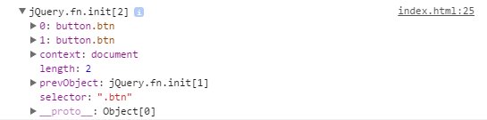

1.jQuery对象和dom对象的区别：

上图是jQuery对象，是一个jQuery在内部构建起来的类数组对象。拥有属性`0` `context` `length`  `prevObjects` `selector` 。这些属性及构建过程是在jQuery.fn.init()方法内进行的。

- `0` 第一个匹配到的dom对象
- `1` 第二个匹配到的dom对象
- `context` 上下文
- `length` 匹配到的dom对象的个数
- `prevObject` 将上一次查找的结果放入prevObject，供回溯时使用。是在pushStack()方法里做的这一步
- `selector` 传入jQuery.fn.init()参与构建本jQuery对象的选择器
- 特别的`__proto__`属性上存放jQuery原型上的方法。这样，这些方法就不用在每次创建jQuery对象时定义了，而是统一向原型继承而来。减少了存储空间、增加了性能。

也就是说，jQuery将选择器选中的dom元素（1个或多个），包装在了一个类数组对象中。增加了context、length、prevObject、selector属性。（便于其他jquery API调用？？）

`$.when()` 看起来跟 `Promise.all()` 功能一样啊。

**jQuery.Deferred()的设计理念来自于CommonJS Promise/A 规范**

ajax缓存的原理。启用缓存时是否server还会接收到请求？缓存在客户端？有效期多长？怎样避免缓存影响更新内容。
前端发送请求时，怎样修改请求头信息？接收到响应时，怎样读取响应头信息？比如ETAG
ajax请求的缓存只能用于get方式？post方式不能缓存？
使用localstorage手动缓存？

#Promise#
[深入理解jQuery、Angular、node中的Promise](http://www.cnblogs.com/stoneniqiu/p/5798661.html)

